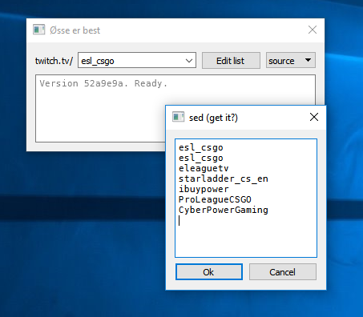

QtStreamer
==========

QtStreamer is a simple dialog to graphically start
[Livestreamer](http://docs.livestreamer.io/). Type in a stream you want to
watch, or select one from the list of streams you've watched before. The list
of streams is remembered and editable.

To use you need to have Livestreamer installed and available in `PATH` and
configured to use the video player of your choice (defaults to VLC). I
recommend using [Chocolatey](https://chocolatey.org/) and running `choco
install livestreamer vlc`.

To build you will need Qt and CMake.
